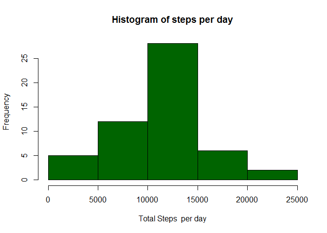
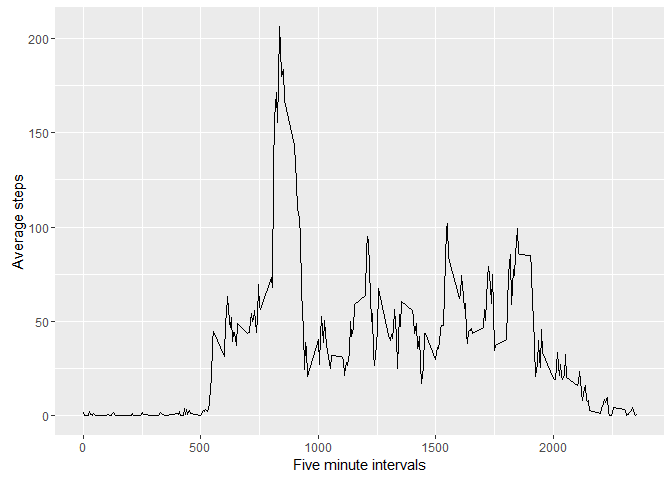
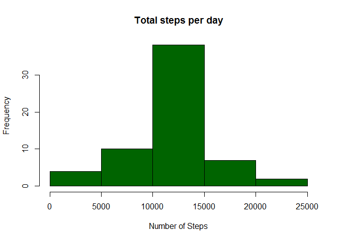
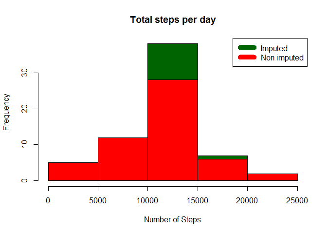
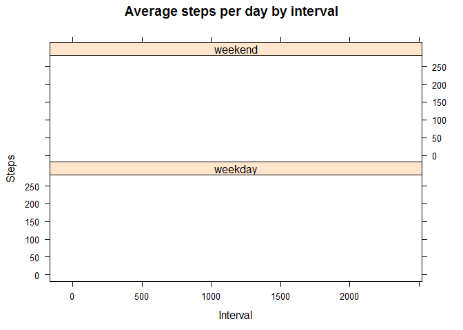

# Reproducible Research: Peer Assessment 1

# Getting and processing data
Load library for the project:  


```r
library(ggplot2) #to do plots  
```

## 1. Load the data  


```r
data.1 <- read.csv("activity.csv")
```


## Clean data, remove NA's

```r
dataf <-na.omit(data.1)
```

## Question 1: Mean number of steps taken per day
First, we will make a histogrm of the total number of steps taken each day


```r
dataf.steps <- aggregate(steps ~ date,dataf,sum)
hist(dataf.steps$steps, col='darkgreen',main = "Histogram of steps per day",xlab="Total Steps  per day")
```


Now we will find the mean and the median of steps per day

```r
rmean <- mean(dataf.steps$steps)
rmedian <- median(dataf.steps$steps)
rmean
```

```
## [1] 10766.19
```

```r
rmedian
```

```
## [1] 10765
```
##Question 2: Calculate the daily activity pattern

```r
dataf.averages <- aggregate(x=list(steps=dataf$steps),by=list(interval=dataf$interval),FUN=mean)
ggplot(data=dataf.averages, aes(x=interval, y= steps)) +geom_line()+xlab("Five minute intervals")+ylab("Average steps")
```




To determine the five minute interal with the max steps across all days:

```r
maxinterval <- dataf.averages[which.max(dataf.averages$steps),1]
maxinterval
```

```
## [1] 835
```
## Imputing missing values
We now need to impute data for the missing values (NA) by inserting the average for each interval.

```r
incomplete <- sum(!complete.cases(data.1))
incomplete
```

```
## [1] 2304
```

```r
imputed_values <- transform(data.1, steps=ifelse(is.na(data.1$steps),dataf.averages$steps[match(dataf$interval, dataf.averages$interval)],dataf$steps))
```
##Recount the total steps and make histogram:


```r
dataf.steps1 <-aggregate(steps ~date,imputed_values,sum)
hist(dataf.steps1$steps,main = paste("Total steps per day"),col="darkgreen",xlab = "Number of Steps")
```



##Create a histogram that shows the difference:


```r
hist(dataf.steps1$steps,main = paste("Total steps per day"),col="darkgreen",xlab = "Number of Steps")
hist(dataf.steps$steps,main = paste("Total steps per day"),col="red",xlab="Number of steps", add=T)
legend("topright",c("Imputed","Non imputed"),col=c("darkgreen","red"),lwd=10)
```




##Compute mean and median for imputed data:  

```r
mean.i <- mean(dataf.steps1$steps)
median.i <- median(dataf.steps1$steps)
mean.i
```

```
## [1] 11092.14
```

```r
median.i
```

```
## [1] 10766.19
```
Calculate difference - imputed vs. non imputed data:  
```{r,eval=TRUE
meandiff <-mean.i - rmean
mediff <- median.i -  rmedian
meandiff
mediff
```
##Calculate the total difference:  

```r
difference <- sum(dataf.steps1$steps) - sum(dataf.steps$steps)
difference
```

```
## [1] 106012.5
```

#Differences in activity patterns between weekends and weekdays


```r
weekdays <- c("Monday","Tuesday", "Wednesday","Thursday","Friday")
imputed_values$dow=as.factor(ifelse(is.element(weekdays(as.Date(imputed_values$date)),weekdays),"weekday","weekend"))

dataf.new <- aggregate(steps~ interval+dow,imputed_values,mean)
library(lattice)

xyplot(dataf.new$steps ~ dataf.new$interval|dataf.new$dow,main="Average steps per day by interval",xlab="Interval",ylab="Steps",layout=c(1,2),type="1")
```


